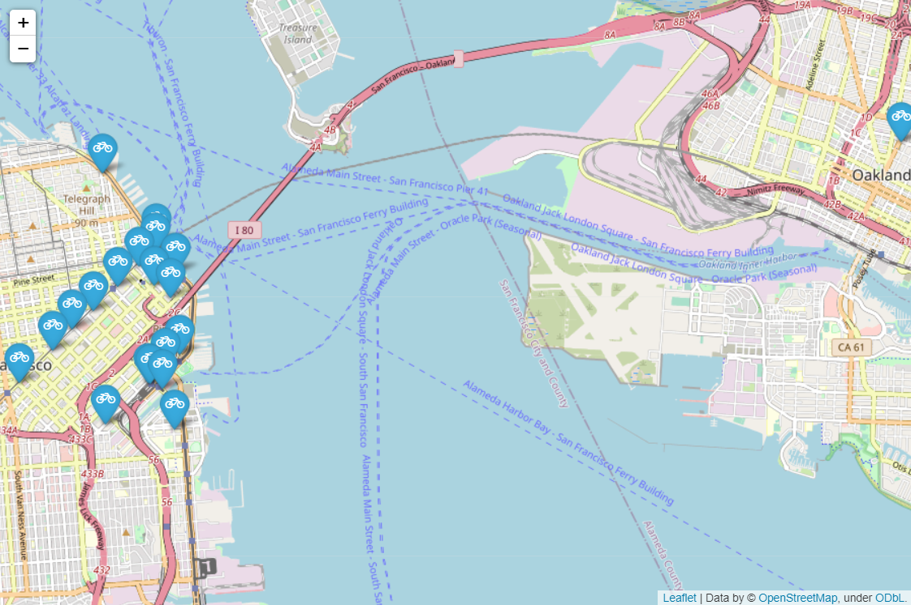

# **Data Analyst Nanodegree** #

# **Project5: Communicate Data Findings** #

# **Bay Area Ford GoBike Data** #

## **UDACITY Project Info** ##

This project has two parts that demonstrate the importance and value of data visualization techniques in the data analysis process. 

* In the first part, you will use Python visualization libraries to systematically explore a selected dataset, starting from plots of single variables and building up to plots of multiple variables. 

* In the second part, you will produce a short presentation that illustrates interesting properties, trends, and relationships that you discovered in your selected dataset. The primary method of conveying your findings will be through transforming your exploratory visualizations from the first part into polished, explanatory visualizations.

## **Dataset** ##

* This data set contains info on bike rides for the years 2017 and 2018 for the Bay area.
* The data was downloaded from https://s3.amazonaws.com/fordgobike-data/index.html